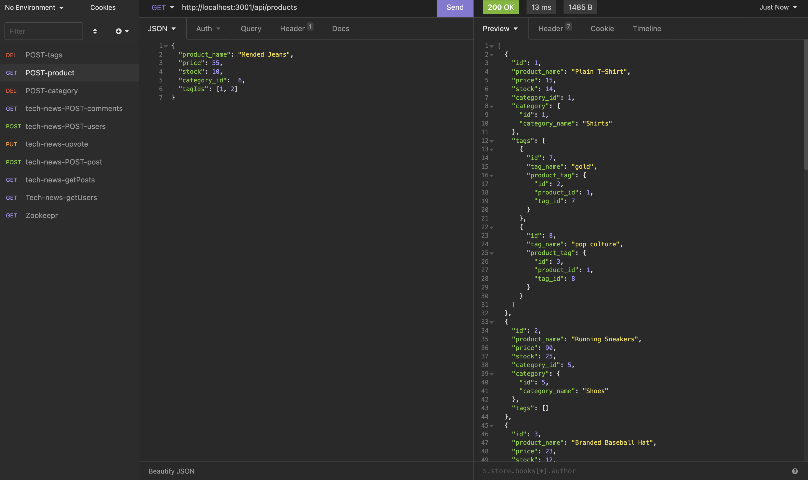

# E-commerce Back End Starter Code

## Description
A back end application for an e-commerce business.  This allows the client to find, create, update and delete data regarding their products

## Usage
Use the following instructions to run the application:
1. Log in to mySQL in your terminal
2. Create the schema using the command "source db/schema.sql"
3. if testing, seed the data using the command "npm run seeds" at the root directory
4. start the server using the command "npm start"
5. For GET and POST routes, use the api endpoints "/categories, /products, /tags"
6. For PUT and DELETE routes, use the api endpoints "/categories/:id, /products/:id, /tags/:id"

## Screenshot 

URL to Walkthrough:
https://www.awesomescreenshot.com/video/7992288?key=9f604ff66608149bde954126eeba7ca9
